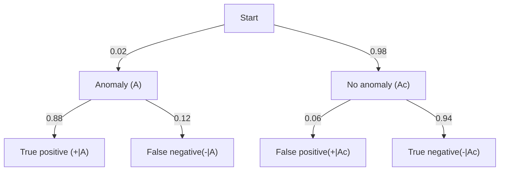

Probability- lab 

This is accompanying coding challenges, problems and tools built along side MIT 18.05

## Lesson 1 Counting and Sets:

$$
P(X=k) = \frac{\binom{n}{k}}{2^n}
$$

In this example, we aim to find the probability of exactly k heads given n fair tosses, where n is the number of tosses and k is the number of heads.

From the principle of the multiplication rule we know, each toss has two possible outcomes, therefore n fair tosses have $2^n$ possible outcomes

The formula for combinations is given by 

$$
\binom{n}{k} = \frac{n!}{k!(n-k)!}
$$

We choose combinations and not permutations, as the order in which we select the positions of 'heads' does not matter.

## Modelling the proabability of a sum in a throwing 2 die event

Assume we have 2 fair-sided die, each numbered 1-6, The outcome space of their sums would look like:

$$
\Omega_S = \{2,3,4,5,6,7,8,9,10,11,12\}
$$

Visually we have:

$$
\begin{bmatrix}
2 & 3 & 4 & 5 & 6 & \boxed{7} \\
3 & 4 & 5 & 6 & \boxed{7} & 8 \\
4 & 5 & 6 & \boxed{7} & 8 & 9 \\
5 & 6 & \boxed{7} & 8 & 9 & 10 \\
6 & \boxed{7} & 8 & 9 & 10 & 11 \\
\boxed{7} & 8 & 9 & 10 & 11 & 12
\end{bmatrix}
$$

Therefore the simple approach taken to find the probability of any given outcome at any given time is a nested for loop which appends an events list whenever the target sum is found.

For example:

$$
P(S=7) = \frac{6}{36} = 16.7\%
$$

## Modelling the probability of an anomaly given an alert

Here we aim to model  a simple cloud cost-monitoring system, which will raise an alert if it believes a genuine cost anomaly or spike has occurred. The posterior is as follows:

> Given that an alert was raised what is the probability that a genuine cost anomaly occured:

We outline the following:

- Prior: $P(A)$ - the probability of an anomaly prior to seeing the alert
- likelihood: $P(+ \mid A)$ - the probability of an alert if a cost anomaly occured
- Posterior: $P(A \mid +)$ - the probability of an anomaly given the alert.

The probability model can be modelled as follows

From Bayes' theorem we can determine the probabilities we are looking for as follows:

$$
P(A \mid +) = \frac{P(+ \mid A)\cdot P(A)}{P(+)}
$$

Similarly:

$$
P(A \mid -) = \frac{P(- \mid A)\cdot P(A)}{P(-)}
$$

To compute these values, we must first find the values of $P(+)$ and $P(-)$

$$
P(+) = P(A) P(+ \mid A) + P(A^c)  (P(+\mid A^c))
$$

$$
P(-) = P(A)  P(- \mid A) + P(A_c) (P(- \mid A^c))
$$

Now we have all the information we need and successfully compute the 'inverse probability' of a genuine cost anomaly occuring given an alert was raised.

### Test Cases

The first test case ensures that the probabilities returned by the function are valid; that is, they are between 0 and 1.

The second test involves a known test case using the values displayed in the chart above. We numerically calculate the expected value of the probability and compare it to that returned by the function.

